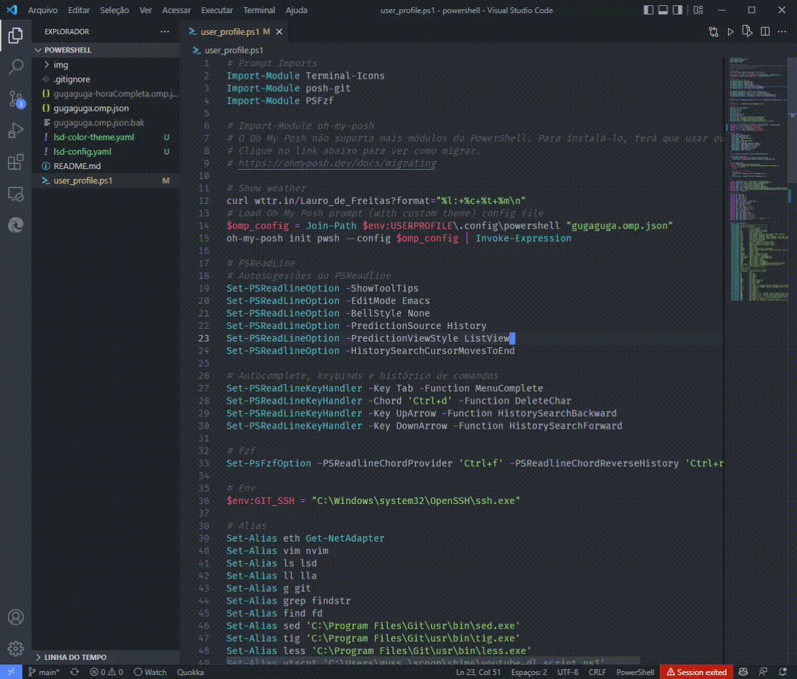
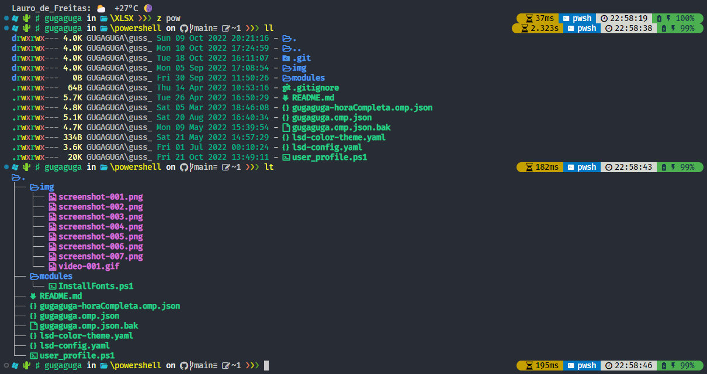
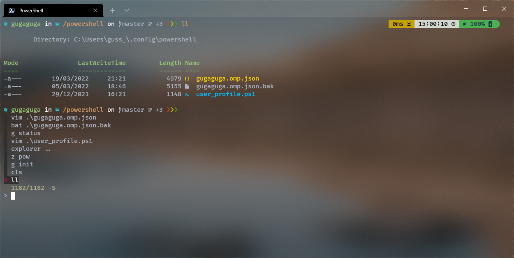
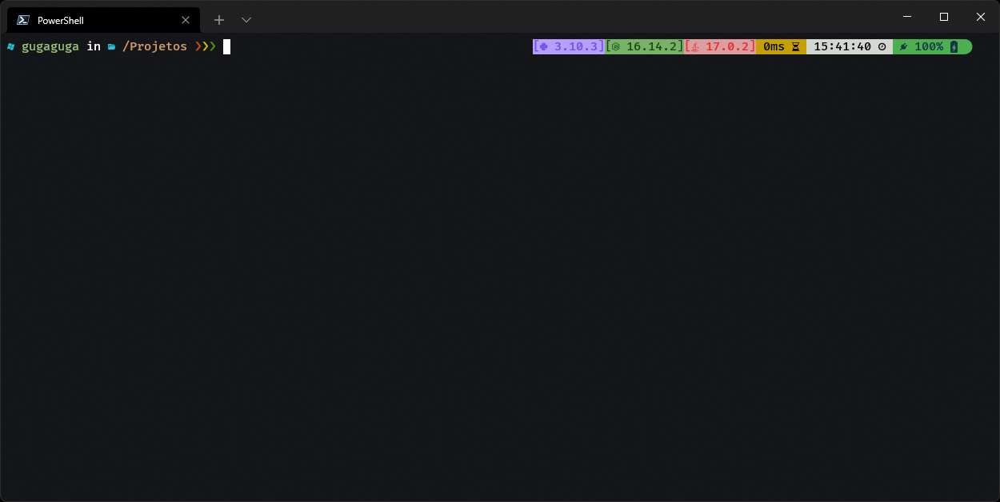
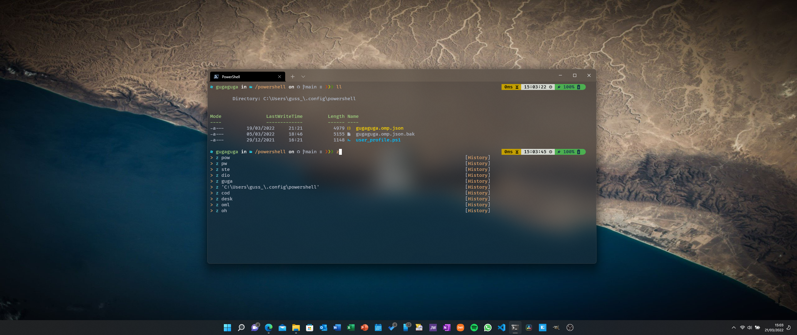
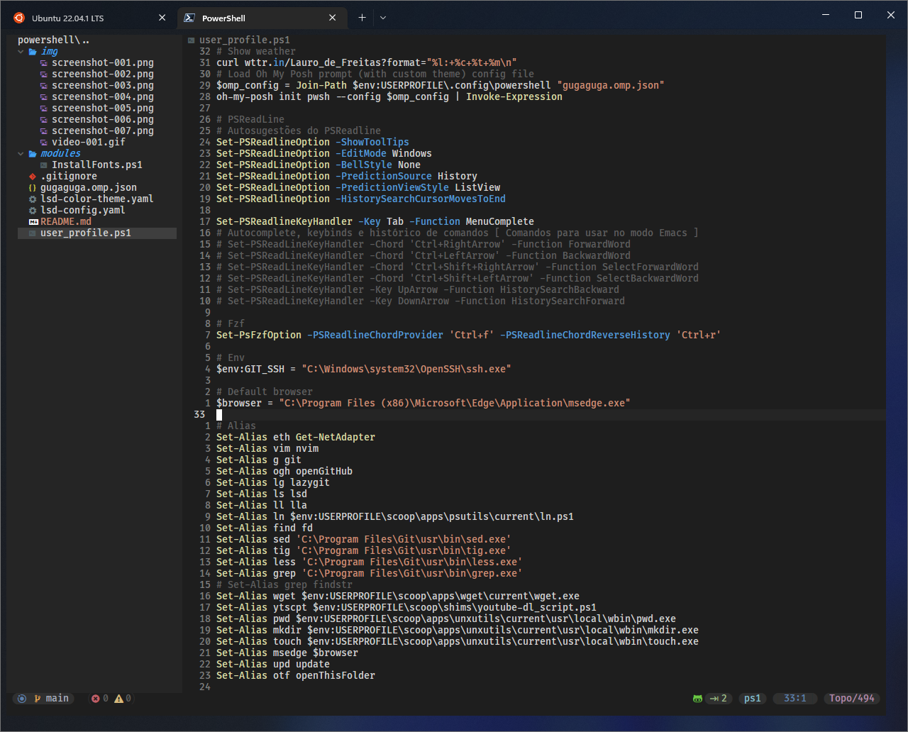

# PowerShell Setup (Windows)

## # Guga's dotfiles - Oh My Posh





<!-- TOC -->

- [PowerShell Setup Windows](#powershell-setup-windows)
    - [# Guga's dotfiles - Oh My Posh](#-gugas-dotfiles---oh-my-posh)
    - [Informações gerais](#informa%C3%A7%C3%B5es-gerais)
    - [Tecnologias utilizadas](#tecnologias-utilizadas)
    - [Como customizar o tema do Oh My Posh](#como-customizar-o-tema-do-oh-my-posh)
    - [Captura de tela](#captura-de-tela)
    - [Sobre mim](#sobre-mim)

<!-- /TOC -->

## Informações gerais

Minhas configurações e tecnologias para utilização do Windows Terminal com o PowerShell.

**Aviso:** Essas são as minhas configurações pessoais. Apenas utilize essas configurações caso saiba em que isso implica. Consulte os manuais através dos links citados.

## Tecnologias utilizadas

- [Powershell](https://github.com/PowerShell/PowerShell)
- [Windows Terminal](https://github.com/microsoft/terminal)
- [Oh My Posh](https://ohmyposh.dev/)
- [Z](https://www.powershellgallery.com/packages/z/1.1.13)
- [Terminal-Icons](https://github.com/devblackops/Terminal-Icons)
- [PSFzf](https://github.com/kelleyma49/PSFzf)
- [PSReadLine](https://docs.microsoft.com/en-us/powershell/module/psreadline/?view=powershell-7.2)
- [Git-Posh](https://github.com/dahlbyk/posh-git)
- [Git for Windows](https://gitforwindows.org/)
- [LSD (LSDeluxe)](https://github.com/Peltoche/lsd)
- [Git for Windows](https://gitforwindows.org/)
- [VSCode](https://code.visualstudio.com/)
- [Nvim](https://github.com/neovim/neovim)
- [Scoop](https://scoop.sh/)
- [Chocolatey](https://chocolatey.org/)
- [Winget](https://docs.microsoft.com/pt-br/windows/package-manager/winget/)
- [Wget](https://www.gnu.org/software/wget/)
- [wttr.in](https://github.com/chubin/wttr.in)

## Como customizar o tema do Oh My Posh

As informações de customização do tema do Oh My Posh podem ser encontradas no link abaixo.

https://ohmyposh.dev/docs/config-overview

Ou poderá clonar os arquivos de configuração na pasta ```\.config\powershell``` e utilizar como referência.

Outra referência muito boa pode ser encontrada em:

https://www.youtube.com/watch?v=5-aK2_WwrmM

## Captura de tela











## Sobre mim

<!-- TOC ignore:true -->
### Olá! 👋

Me chamo Gustavo Siqueira, também conhecido como Guga. Estou aqui para compatilhar códigos com o mundo!

- 🌱 Atualmente estudo front-end 🌎 Web Development: HTML | CSS | JavaScript.
- 🦾 Atualmente estudo back-end: ☕ Java | 🐍 Python | 🟪 C#
- 🐞 Atualmente estudo QA: Testes automáticos com JUnit | Selenium | Cucumber | Appium
- 📫 Pode me contatar através do e-mail: guss.ns@gmail.com

<div align="center">
  <a href="https://github.com/siqueira-gustavo">
  
  
</div>
<div style="display: inline_block"><br>
  
  
  
  
  
  
  
  
  
  
  
  
</div>

<!-- TOC ignore:true -->
##

<div>
  <a href = "mailto:guss.ns@gmail.com"></a>
  <a href="https://www.linkedin.com/in/gustavo-siqueira-759465181/" target="_blank"></a>

  <!--  -->

</div>
